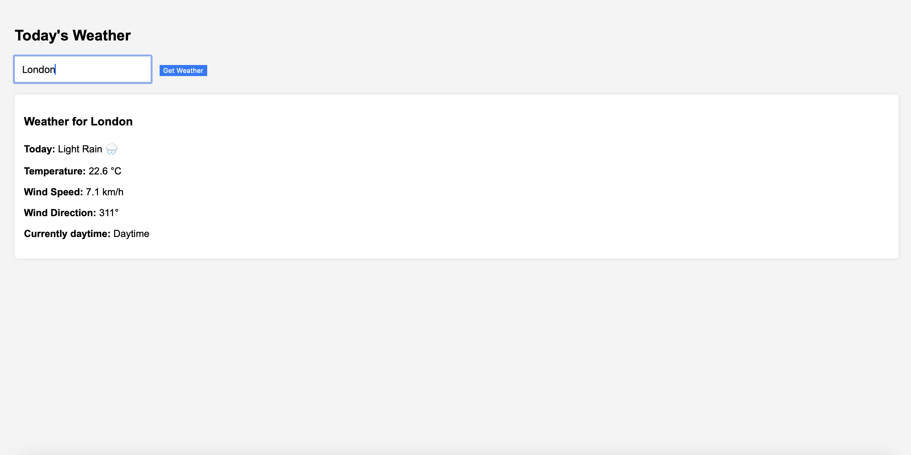

# CurrentWeather Minimal API


## Overview

_CurrentWeather Minimal API_ is a lightweight and efficient web application that provides real-time weather information for any city worldwide.  
Built using **.NET 9 Minimal API**, this project demonstrates my capability to create clean, minimalistic backend services while integrating third-party APIs and delivering JSON responses optimized for frontend consumption.

---

## Features

- **Minimal API Architecture:**  
  Uses the modern .NET Minimal API approach, minimizing boilerplate and focusing on straightforward, readable endpoint definitions.

- **Geolocation Lookup:**  
  Converts user-input city names to geographic coordinates via OpenStreetMap's Nominatim API.

- **Weather Data Integration:**  
  Fetches current weather conditions from the Open-Meteo API based on latitude and longitude.

- **Frontend Interface:**  
  A simple, responsive HTML/JavaScript frontend enables users to search for cities and view detailed weather information including temperature, wind speed/direction, weather description, and day/night status.

- **Error Handling:**  
  Provides user-friendly messages for invalid cities or API failures.

- **Loading Indicator:**  
  Includes a subtle spinner animation during data fetch for better UX.

- **Swagger Integration:**  
  API documentation and testing interface enabled in development mode.

---

## How It Works

1. The client sends a city name query to the `/weather` endpoint.

2. The Minimal API backend calls OpenStreetMap to resolve the city name into latitude and longitude.

3. Using these coordinates, the API fetches current weather data from Open-Meteo.

4. The JSON response with weather details is returned to the frontend.

5. The frontend parses this data and displays a clean summary including a weather icon, temperature, wind speed, and more.

---

## Usage

1. Clone the repository  
2. Run the project with `dotnet run`  
3. Open your browser to `http://localhost:5000` (or the specified port)  
4. Search for any city and enjoy instant weather updates.

---

## Screenshot

Here’s a quick look at the app interface:



---

## Code Snippet - Minimal API Endpoint

```csharp
app.MapGet("/weather", async (string city) =>
{
    using var httpClient = new HttpClient();

    // Convert city name to coordinates
    var geoUrl = $"https://nominatim.openstreetmap.org/search?q={city}&format=json&limit=1";
    httpClient.DefaultRequestHeaders.UserAgent.ParseAdd("WeatherApp/1.0");
    var geoResponse = await httpClient.GetStringAsync(geoUrl);
    var geoData = JsonSerializer.Deserialize<List<GeoResult>>(geoResponse);

    if (geoData == null || geoData.Count == 0)
        return Results.NotFound($"City '{city}' not found.");

    var lat = geoData[0].Lat;
    var lon = geoData[0].Lon;

    // Fetch weather data from Open-Meteo API
    var weatherUrl = $"https://api.open-meteo.com/v1/forecast?latitude={lat}&longitude={lon}&current_weather=true";
    var weatherResponse = await httpClient.GetStringAsync(weatherUrl);

    return Results.Content(weatherResponse, "application/json");
});

Created by kocakla
Last updated: 2025-07-28
